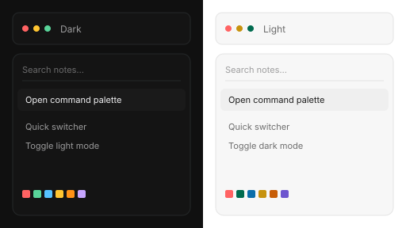
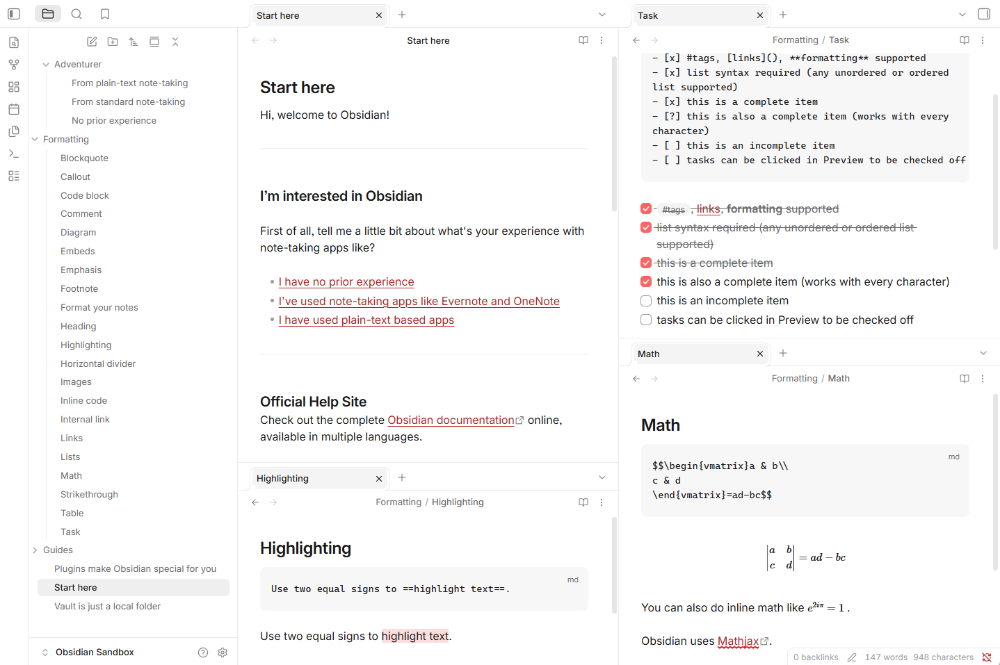
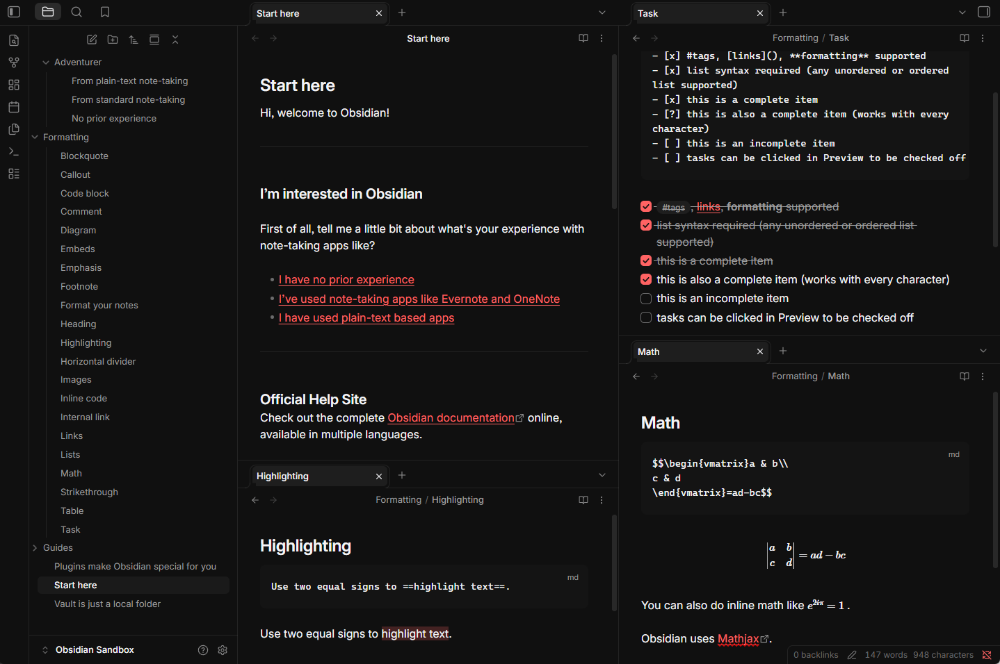

# RaggioProietto

A sleek, modern Obsidian theme with a touch of coral, inspired by the Raycast application.

> Unofficial theme. Inspired by Raycast and the ChatGPT desktop “Raycast” partner palette. Not affiliated with, endorsed by, or associated with Raycast or OpenAI.

## Preview

| Light | Dark |
| --- | --- |
|  |  |

## Features

- Dark and light from **Appearance → Base color scheme**
- Coral accent (`#ff6363`) on controls in both modes
- Command palette, menus, and settings with hairline borders, 6–12px radii, and keycap-style hotkeys
- Inter for UI and reading, JetBrains Mono for code

## Palette

| | Dark | Light |
|---|---|---|
| Surface | `#101010` | `#ffffff` |
| Code | `#141414` | `#f7f7f7` |
| Text | `#f4f4f6` | `#1a1a1a` |
| Accent | `#ff6363` | `#ff6363` |
| Links | `#ff6363` | `#b12424` |
| Green | `#59d499` | `#006b4f` |
| Blue | `#56c2ff` | `#0b6eaa` |
| Yellow | `#ffc531` | `#c7920e` |
| Orange | `#ff9217` | `#c75d07` |

Light links use a darker red so they keep contrast on white. Syntax colors are shifted the same way.

## Install

### Community themes

1. Open **Settings → Appearance**
2. Next to **Themes**, click **Manage**
3. Search **RaggioProietto**
4. **Install**, then **Use**
5. Set **Base color scheme** to dark or light

### Manual

1. Download `manifest.json` and `theme.css` from the [latest release](https://github.com/martinopiaggi/RaggioProietto/releases)
2. In your vault, create `.obsidian/themes/RaggioProietto/`
3. Put both files in that folder (the folder name must match `"name"` in `manifest.json`)
4. **Settings → Appearance → Themes → RaggioProietto**
5. Set **Base color scheme** to dark or light

Requires Obsidian 1.6.0 or later.

## License

MIT. See [`LICENSE`](LICENSE).
